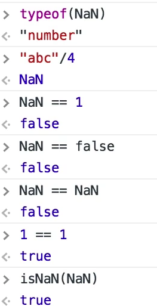
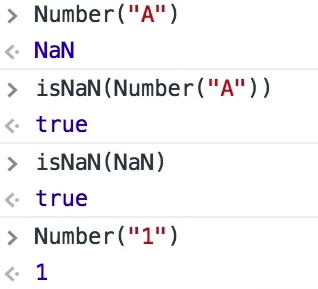

## Advanced Javascript Notes

### "use strict";

* enable strict mode
* unable to use delete (can't delte any variable or function)
* eval variable declaration will not work

### pass by value and pass by reference

* primitive types such as string, number, boolean pas by value. Objects are pass by reference
    ```
    var a = 1
    function foo(a){
        a = 2;
    }
    foo(a)
    console.log(a)
    #Output
    1
    ```
* pass by value, copy the value only, modification inside the element won't effect
* pass by refrence, if any changes in the object withing the function it will change outside the scope

    ```
    // pass by reference
    var a = {"b": "ball"}
    function foo(a){
        a.a = "apple"
    }
    foo(a)
    console.log(a)
    #Output
    {b: "ball", a: "apple"}

    var a = {"b": "ball"}
    function foo(a){
        a = {"a": "apple"}
    }
    foo(a)
    console.log(a)
    #Output
    {b: "ball"}
    
    ```

## Data Types

### primitive type
* Boolean // true/false
* String // "string", 'string'
* Number // 1, 1.0
* null 
* undefined
### Non primitive
* Object ( {}, new Object())

#### Dynamically Typed Language
* Type of datatype change dynamically
    ```
    "use strict";
    var a = 'my string';
    console.log(typeof(a))
    a = 1;
    console.log(typeof(a))
    
    # Output
    string
    number
    ```
* variable type initially undefined till it set a value
* null never set javascript, it should set by human
* null and undefined are values that is null and undefined :) (in other languages it has abscense of value)
* null == undefined (true)
* undefined == null (true)

### diffrence in == and ===
* == compare value
* === compare both value and type

    ```
    > '' == 0
    true
    > 0 == false
    true
    > false == "0"
    true
    > false == 0
    true
    ```
* NaN : typeof(NaN) =  number

       
* Parameter inside the isNan() function is trying to convert to Number

    


## variable hoisting
* variable initialize in the top of the scope
     ```
     "use strict";
     console.log(a);
     var a = 1;
     
     #output
     undefined
     ```